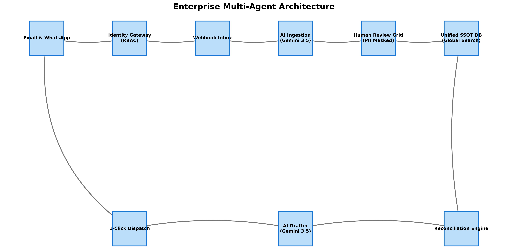

# ✈️ BharatTrip AI Escalation Resolver & SSOT Prototype

[](https://www.python.org/downloads/)
[](https://vktoflyss.streamlit.app/)
[](https://www.docker.com/)



## 📌 Executive Summary
Customer and agent escalations regarding refunds are rising at BharatTrip. Our deep data reconciliation revealed **100 dropped tickets** and **149 deduction mismatches** caused by a severe operational disconnect between the Support and Finance trackers. 

This repository contains the prototype for a unified **Single Source of Truth (SSOT)** driven by a **Multi-Agent AI Architecture**. It leverages `gemini-3.5-flash` to ingest messy WhatsApp/Email messages, extract structured data, and orchestrate automated communications with external agents via a secure Human-In-The-Loop (HITL) approval process.

## 🚀 Live Demo
**👉 [Play with the Live Web App Here](https://8cunvwdmk9flgvtimrswxr.streamlit.app/)**

> **Note to Reviewers:** The application automatically detects your API key type. You can securely input either an **OpenAI API Key** (`sk-...`) or a **Google Gemini API Key** (`AIzaSy...`) in the app settings, and it will dynamically route to the correct LLM backend.

## 🛠️ The Solution Framework

| Operational Failure | AI / Engineering Solution |
| :--- | :--- |
| **Off-Tracker WhatsApp Leakage** | **AI Ingestion Agent** extracts structured entities (Agent Name, Route, Urgency) from messy natural language. |
| **"Short Payment" Discrepancies** | **Reconciliation Agent (HITL)** auto-drafts explanatory emails justifying cancellation fees before dispatch. |
| **Silent Handoff Drops** | **Unified SSOT Database** eliminates manual sheet-to-sheet handoffs entirely. |

### Advanced Features
- **Operations Telemetry Dashboard**: Live KPI tracking for Escalations and Discrepancies to prove ROI.
- **Unhappy Path Mitigation**: Built-in hallucination checks against valid travel sectors and automated flagging for missing information.
- **MCP Ready**: Architecture is designed to integrate with enterprise databases securely using the Model Context Protocol, ensuring API keys never touch the DB.

## 📊 Data Verification & Methodology
The business metrics (100 drops, 149 mismatches) were derived via strict programmatic database joins (Anti-Joins & Inner Joins). 
For a complete breakdown of the data science methodology, please review the **[Data Analysis Methodology](deliverables/data_analysis_methodology.md)**.

## 💻 Local Installation

**Option A: Docker (Recommended)**
```bash
docker build -t bharattrip-ssot .
docker run -p 8501:8501 -e GEMINI_API_KEY="your_api_key" bharattrip-ssot
```

**Option B: Python Virtual Environment**
```bash
pip install -r requirements.txt
export GEMINI_API_KEY="your_api_key"  # Or OpenAI Key
streamlit run app.py
```
